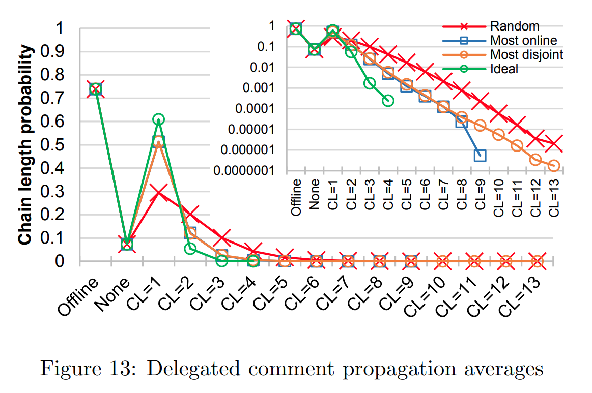

### Comment Delegation Propagation Simulation

*This simulation developed for an academic journal which is in review*

In this simulation, we aimed to find out the best way to handle comments in a decentralized social network application 
while a user goes offline. During this offline time, the user gives delegation to a friend for handling comments below 
posts, and this delegation goes on until user come back or one of the previously delegated friends come back. We 
evaluated following three delegations heuristics along with an ideal scenario where an oracle tells which of the 
currently online friends will remain online the most;

1. a random friend
2. friend who has recently been online the most
3. friend who has recently been online the most while the user if offline (i.e., most disjointly online).

We simulated these scenarios using the online timing of each user in the circle of Facebook volunteers [data](https://ieeexplore.ieee.org/document/7365914). We assumed the online timing of oneof  the  volunteer’s  friends  as  the  online  timing  of  the  main  user  as  long  asthe  friend  appeared  online  for  at  least  a minute.   We  performed  a  timedsimulation  of  when  the  user  goes  offline,  for  how  long  the  user  is offline,and the delegation chain in the user’s absence.  We recorded for how long aparticular chain length is observed while the user is offline.

Figure 12 presents the chain length probability of each simulation case of
the 2,266 timing samples from 16 users’ friend circles where probabilities are
independently ranked for clarity. We determined the most disjointly online
and most online persons based on the 5 previous day’s data assuming a circular time to use on the first five day’s calculations.

 